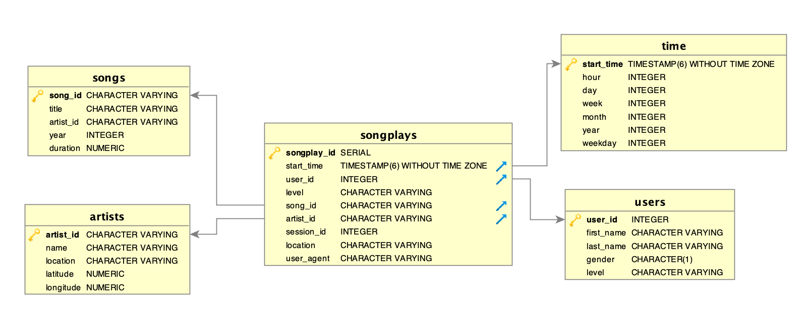

# Data Lake: Sparkify
## Overview
The goal of this project is to create a ETL pipeline to process a CSV and JSON files stored in S3 (data lake structure) to parquet files that will be used for analytics.

We will use Spark to this end. `log_data` and `song_data` will be processed and return the star schema that we've been seeing in previous lessons.


## Structure
The project contains the following files:
1. `bucket.py`: It will allow us to create a S3 bucket, delete an empty S3 bucket or list all S3 buckets available.
2. `working_on_etl.ipynb`: This has been the testing area to build the ETL pipeline.
3. `etl.py`: The main file for this project.
4. `dl.cfg`: Credentials file. You can copy the `dl.cfg.example` file and rename it to `dl.cfg`. You'll then need to fill the credentials.

## Instructions
- Copy the `dl.cfg.example` file and rename it to `dl.cfg`. 
- Fill `dl.cfg` with your AWS credentials.
- To list all S3 buckets in your account:
```
python3 bucket.py list <name_of_bucket>
```
- To create a new bucket use:
```
python3 bucket.py create <name_of_bucket>
```
- To delete an existing empty bucket use:
```
python3 bucket.py delete <name_of_bucket>
```
Make sure you've created a bucket called `sparkify-analytics-with-spark`. It will be used to store the ETL outputs.

Finally, run the etl by running:
```
python3 etl.py
```
